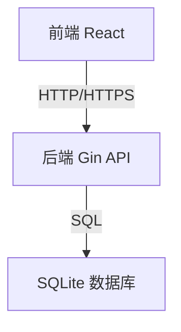

# 项目设计文档

## 一、项目简介

本项目为一套前后端分离的 Web 应用，前端采用 React 技术栈，后端采用 Go 语言的 Gin 框架，数据库初期采用 SQLite，后续可根据需求切换为 MySQL、PostgreSQL 等。

## 二、技术选型

- 前端：React + TypeScript + Axios + Ant Design（可选 UI 框架）
- 后端：Go + Gin + GORM（ORM 框架）
- 数据库：SQLite（后续可扩展）
- 接口通信：RESTful API（JSON 格式）

## 三、系统架构

## 四、功能模块

### 1. 前端

- 用户登录/注册
- 主页展示
- 数据录入与查询
- 个人中心
- 其他业务功能

### 2. 后端

- 用户认证（JWT）
- 数据接口（CRUD）
- 日志与异常处理
- 权限管理
- 其他业务逻辑

### 3. 数据库

- 用户表
- 业务数据表
- 日志表
- 其他扩展表

## 五、接口设计（示例）

| 接口名称      | 方法 | 路径           | 描述         | 请求参数         | 返回参数         |
|---------------|------|----------------|--------------|------------------|------------------|
| 用户注册      | POST | /api/register  | 用户注册     | username, password | code, message    |
| 用户登录      | POST | /api/login     | 用户登录     | username, password | token, userInfo  |
| 获取用户信息  | GET  | /api/user      | 获取用户信息 | token            | userInfo         |
| 数据查询      | GET  | /api/data      | 查询数据     | token, query      | dataList         |
| 数据新增      | POST | /api/data      | 新增数据     | token, data       | code, message    |

## 六、数据库设计（示例）

### 用户表（users）

| 字段名     | 类型         | 描述         |
|------------|--------------|--------------|
| id         | INTEGER      | 主键，自增   |
| username   | VARCHAR(64)  | 用户名       |
| password   | VARCHAR(128) | 密码（加密） |
| created_at | DATETIME     | 创建时间     |

### 业务数据表（data）

| 字段名     | 类型         | 描述         |
|------------|--------------|--------------|
| id         | INTEGER      | 主键，自增   |
| user_id    | INTEGER      | 用户ID       |
| content    | TEXT         | 业务内容     |
| created_at | DATETIME     | 创建时间     |

## 七、开发计划

1. 搭建前端项目结构，完成基础页面
2. 搭建后端 Gin 项目，完成基础接口
3. 设计并初始化 SQLite 数据库
4. 前后端联调，完成主要功能
5. 测试与优化

## 八、后续扩展

- 数据库可切换为 MySQL/PostgreSQL
- 增加更多业务模块
- 接入第三方服务（如短信、邮件等）
- 部署与运维自动化 